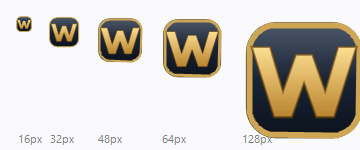
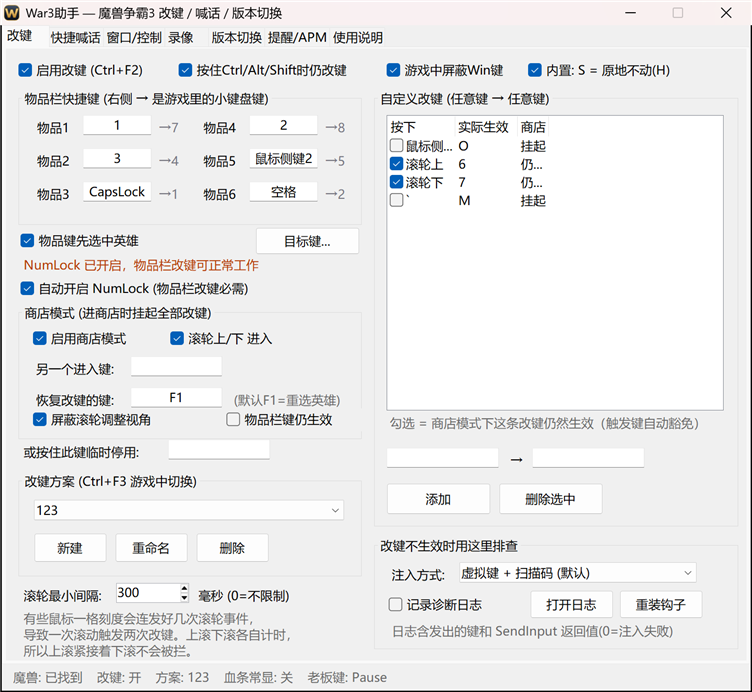
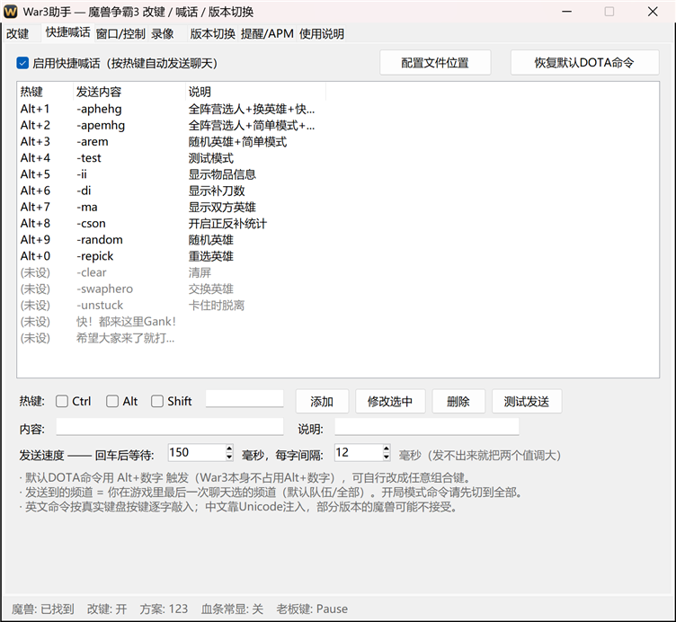
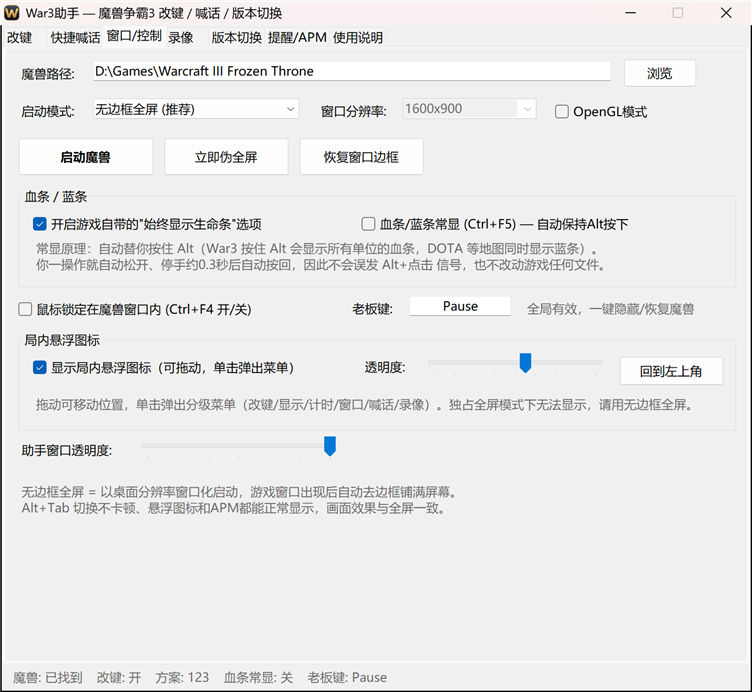
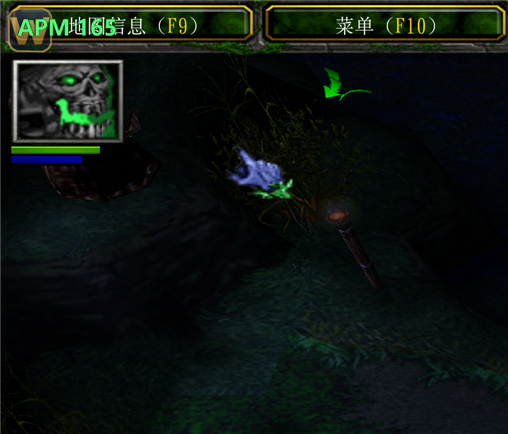
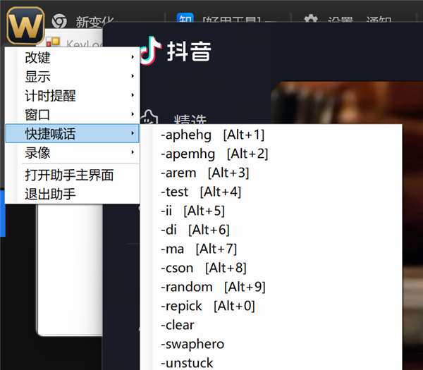
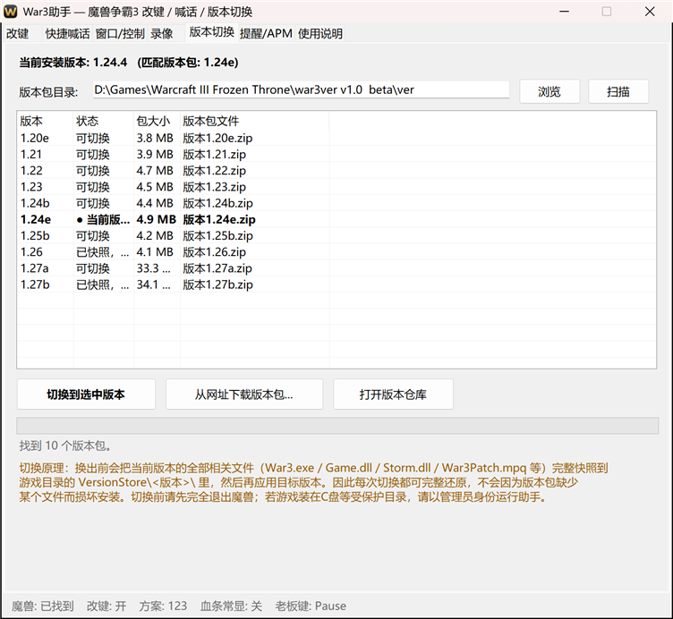
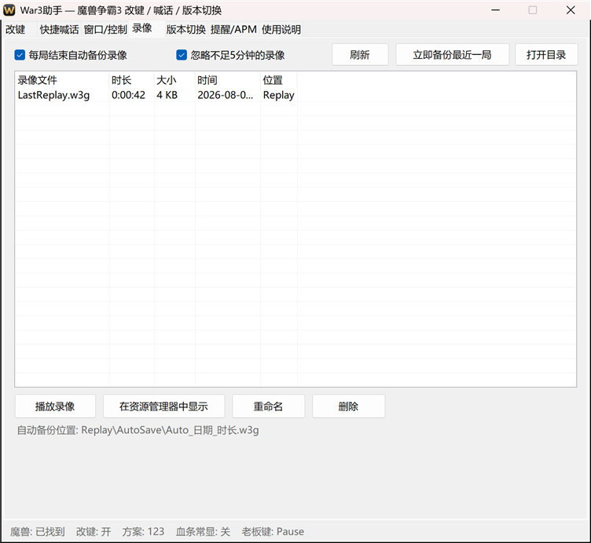
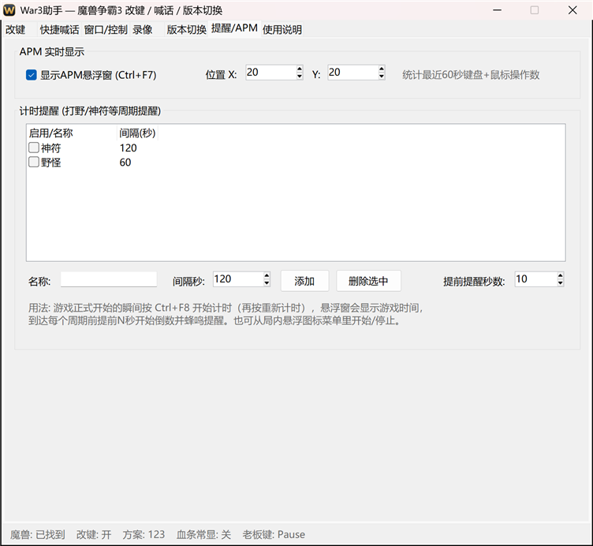

<div align="center">



# War3助手

**魔兽争霸3 全能辅助 —— 改键 · 喊话 · 血条 · 版本切换 · 录像管理**

经典工具 **U9WSH（魔兽超级助手 v4.6, 2011）** 的复刻增强版<br>
无广告 · 无积分 · 无联网 · 不注入游戏进程 · 单文件 230KB

</div>

---

## 这是什么

一个给《魔兽争霸3》用的桌面辅助工具。把顺手的键映射到物品栏、一键发 DOTA 开局命令、
血条常显、一键切换游戏版本、自动备份录像——这些原版 U9WSH 有的实用功能都在，
广告和积分系统都去掉了，并且针对 Win11 和高 DPI 屏做了适配。

**和原版最大的不同**：本工具用系统级键鼠钩子实现，**不注入游戏进程、不读写游戏内存**。
代价是没有依赖内存注入的功能（AI 一键操作、JASS 脚本），换来的是：

- 兼容 **1.20 ~ 1.28 任意版本**，切换游戏版本不用更新助手
- 没有封号风险（原版的显血显蓝走内存补丁，原版自己都提示有风险）
- 改键只在魔兽窗口为前台时生效，切出游戏完全不影响其他程序

---

## 功能一览

### 改键



- **物品栏 6 格**：把顺手的键映射到游戏里的物品栏快捷键，每格右边直接标出目标键
- **任意键 → 任意键**：支持鼠标侧键 / 中键 / 滚轮 → 键盘键，也支持键盘键 → 鼠标左右键
- **多方案**：不同地图不同方案，游戏中 `Ctrl+F3` 或局内菜单一键切换
- **商店模式**：滚一下滚轮就挂起改键（商店里 `S` 还是 `S`，能正常买树枝），按 `F1` 重选英雄时自动恢复
- **自动开 NumLock**：物品栏快捷键是小键盘，NumLock 关着时它们在系统层面就是方向键 —— 助手会替你打开，**键盘上没有 NumLock 键也没关系**
- **滚轮节流**：不少鼠标滚一格会连发好几条事件，默认 300ms 内的重复直接丢弃
- **排查面板**：诊断日志会记录每次按键改成了什么、`SendInput` 返回值是多少

### 快捷喊话



按热键自动完成「回车 → 输入 → 回车」，支持 `Ctrl/Alt/Shift` 组合键。
内置 DOTA 常用命令，默认绑在 **`Alt+1` ~ `Alt+0`**：

| 热键 | 命令 | 说明 | 热键 | 命令 | 说明 |
|---|---|---|---|---|---|
| `Alt+1` | `-aphehg` | 全阵营+换英雄+快速金钱 | `Alt+6` | `-di` | 显示补刀数 |
| `Alt+2` | `-apemhg` | 全阵营+简单+快速金钱 | `Alt+7` | `-ma` | 显示双方英雄 |
| `Alt+3` | `-arem` | 随机英雄+简单模式 | `Alt+8` | `-cson` | 正反补统计 |
| `Alt+4` | `-test` | 测试模式 | `Alt+9` | `-random` | 随机英雄 |
| `Alt+5` | `-ii` | 显示物品信息 | `Alt+0` | `-repick` | 重选英雄 |

英文命令按**真实键盘按键逐字敲入**（和你自己打字一样），兼容性最好。

### 窗口 / 血条



- **无边框全屏**（默认）：按桌面分辨率窗口化启动，窗口一出现自动去边框铺满。Alt+Tab 秒切，悬浮窗能正常显示
- **血条 / 蓝条常显**：直接写魔兽自己的设置（注册表 `Gameplay\healthbars`），等同于游戏里 选项→游戏性 勾上「生命条」。不占用任何按键
- **锁鼠标**、**老板键**、**屏蔽 Win 键**、OpenGL 模式、分辨率下拉

### 局内悬浮图标

<table>
<tr>
<td width="50%"></td>
<td width="50%"></td>
</tr>
<tr>
<td align="center"><sub>真实游戏中：左上角半透明图标 + APM 实时显示</sub></td>
<td align="center"><sub>单击弹出分级菜单，不用切出游戏</sub></td>
</tr>
</table>

可拖动、透明度可调，单击弹出六个分级菜单：改键 / 显示 / 计时提醒 / 窗口 / 快捷喊话 / 录像。
用逐像素透明的分层窗口实现，圆角是真透明不是抠色。

### 版本切换



扫描版本包目录（会自动识别 `war3ver` 那种 `ver` 目录），一键在 1.20e ~ 1.27b 之间切换。

**为什么是安全的**：版本包之间的文件集并不一致——1.24e 的包里**没有** `War3Patch.mpq`，
而 1.27 的包自带 `war3patch.mpq`。直接解压覆盖会导致切回 1.24 时补丁包丢失、游戏起不来。
所以切换流程是：

1. 换出前，把当前版本的**全部受管文件**完整快照到 `<魔兽目录>\VersionStore\<版本名>\`
2. 目标版本**优先从版本仓库还原**，仓库没有的再从 zip 补齐
3. 目标不需要、当前却有的受管文件移到 `VersionStore\_disabled\`（不删除）
4. 收尾校验补丁包是否存在，缺失会明确报错并告知还原路径

非受管文件（`war3.mpq`、地图、存档、录像）全程不动。仓库里带一个沙箱测试专门验证来回切换不丢文件。

### 录像 / 提醒

<table>
<tr>
<td width="50%"></td>
<td width="50%"></td>
</tr>
</table>

- 每局结束自动备份 `LastReplay.w3g`，文件名含日期与时长（解析 w3g 头部），可忽略 5 分钟内的局
- 录像目录浏览：时长 / 大小 / 时间，支持播放、重命名、删除
- APM 实时显示（最近 60 秒操作数）、周期计时提醒（神符 120 秒、野怪刷新等）

---

## 热键

魔兽窗口为前台时生效：

| 热键 | 作用 |
|---|---|
| `Ctrl+F2` | 改键 开/关 |
| `Ctrl+F3` | 切换改键方案 |
| `Ctrl+F4` | 鼠标锁定 开/关 |
| `Ctrl+F7` | APM 悬浮窗 开/关 |
| `Ctrl+F8` | 计时提醒 开始/重新计时 |
| `Pause`（可改） | 老板键，任何时候可用 |

---

## 上手

1. 双击 `bin\War3Helper.exe`
2. 「窗口/控制」页填好魔兽路径，点「启动魔兽」
3. 「改键」页点输入框，按下你想用的键即可

配置存在 `%APPDATA%\War3Helper\config.json`，重新编译、删 `bin\`、重新 clone 都不会丢。
想让配置跟着程序走（绿色版），在 exe 旁边放一个空的 `portable.txt`。

---

## 常见问题

**物品栏改键没反应？**
九成是 NumLock。魔兽的物品栏快捷键是小键盘 7/8/4/5/1/2，NumLock 关着时这些键在系统层面
就是 Home/↑/←/Clear/End/↓。助手默认会自动打开 NumLock，改键页会显示当前状态。

**改键完全没反应？**
确认魔兽不是以管理员身份运行；如果是，把助手也用管理员身份运行（权限低的进程无法向权限高的进程发送输入）。
还不行就勾上「记录诊断日志」，进游戏按几下再回来看日志——`SendInput` 返回 0 就是注入被系统拒绝了。

**打字的时候按键被改掉了（比如空格变成小键盘2）？**
默认已经处理：按回车打开聊天栏后自动暂停改键，再按回车发送或按 Esc 取消后恢复，
状态栏会显示「打字中(已暂停)」。不想要这个行为可以在改键页取消勾选「打字时暂停改键」。

聊天栏开着没开着，游戏不会告诉外部程序，但这个状态完全由你自己的按键决定
（回车开、回车发、Esc 取消），所以不用猜游戏状态也能准确跟踪。
兜底：如果状态卡住了，30 秒没按键会自动复位，切出游戏也会复位。

**按 Shift+物品键 时英雄被取消选中了？**
已修。开了「物品键先选中英雄」时，助手注入 F1 之前会先把你按住的修饰键临时松开
（魔兽里 Shift+F1 是切换选中状态，会把本来选着的英雄取消掉），发完再按回去，
所以 Shift+物品（排队使用）照常工作。

**在商店里按 S 买不了树枝？**
改键把 S 换掉了。用「商店模式」：滚一下滚轮挂起改键，按 `F1` 重选英雄时自动恢复。
挂起期间悬浮窗会**常驻**显示「商店模式 · 改键已挂起」，一眼能看出当前到底挂没挂起
（以前只闪 1.8 秒，出问题时根本分不清）。

如果你**同时开了血条常显**，v1.0.2 及以前还有另一个原因：那时血条常显是靠一直按住 Alt 实现的，
而鼠标钩子只在**点击**时松开 Alt，**漏了滚轮**。于是滚轮改键发出去的键带上了 Alt
（本该是 `7` 的变成 `Alt+7`），编队没选中，商店压根没被选上，接着按 S 当然买不到东西。
v1.0.4 起「按住 Alt」这套方案整个删掉了，改用魔兽自己的设置，这个坑不存在了。

**物品键双击（对自己施法）没反应？**
如果开了「物品键先选中英雄」：连按同一个键时助手不会重复插入选择指令，
否则第二次按下前先选一次英雄会把「指定目标」状态取消掉，双击就永远生效不了。
0.6 秒内的连按算同一次。

**滚一下滚轮之后物品键就不灵了？**
商店模式生效期间物品栏键默认也被挂起。如果你用滚轮当商店模式的进入键，
滚一下之后物品键要等按 `F1` 才恢复。想让物品键一直可用，
在商店模式里勾上「物品栏键仍生效」。

**局内悬浮图标 / APM 看不到？**
独占全屏下任何悬浮窗都盖不上去，用默认的「无边框全屏」。

**双击 exe 没反应？**
说明已经有一个实例在跑了。再双击一次会把已有窗口叫到前台（不会开第二个）。
也可以直接点系统托盘的图标。

**打开发现设置变回默认了？**
不会再发生了。加载顺序是 `config.json` → `config.json.bak` → 默认值：主文件读不出来时
先从备份恢复，并把读不出来的原文件改名保留成 `config.json.broken-<时间>.json`，同时弹窗告诉你路径。
只有备份也没有时才会用默认值，而且原文件绝不会被覆盖。

保存也改成了原子替换（`File.Replace`）。之前是「复制到 .bak → 删除主文件 → 重命名临时文件」，
中间有一小段主文件不存在的窗口，另一个实例正好在那一刻启动就会以为没有配置而套用默认值，
接着它一保存，改键方案就被永久抹掉了。

想确认程序到底在读哪个文件，运行 `powershell -ExecutionPolicy Bypass -File .\build-dump.ps1`。

---

## 从源码构建

只需要 Windows 自带的 .NET Framework 4.x，**不用装任何 SDK**：

```bash
powershell -ExecutionPolicy Bypass -File build.ps1
```

跑测试（不需要开游戏，锁屏也能跑）：

```bash
powershell -ExecutionPolicy Bypass -File build-test.ps1
```

### 源码结构

C# 5 / WinForms，兼容系统内置的 `csc` 编译器。

| 文件 | 职责 |
|---|---|
| `src/Program.cs` | 入口、单实例、DPI 缩放 |
| `src/Native.cs` | Win32 P/Invoke |
| `src/IconGen.cs` | 纯代码绘制图标并打包多尺寸 `.ico` |
| `src/Config.cs` | 配置模型、默认值、跨版本迁移 |
| `src/Engine.cs` | 键鼠底层钩子、改键、组合键喊话、APM、商店模式 |
| `src/War3Ctl.cs` | 魔兽窗口查找/启动/伪全屏/锁鼠标/老板键、录像 |
| `src/War3Version.cs` | 版本识别、快照式切换、版本包下载 |
| `src/Overlay.cs` | 置顶穿透悬浮窗（APM / 计时提醒） |
| `src/InGameMenu.cs` | 局内可拖动半透明图标 + 分级菜单 |
| `src/Diag.cs` | 诊断日志（环形缓冲 + 后台刷盘） |
| `src/MainForm.cs` | 主界面 |
| `tools/Test*.cs` | 测试（115 项断言） |

### 几个踩过的坑

写在这里，改代码时别再踩：

- **低层钩子的回调运行在安装它的线程上**，也就是 UI 线程。UI 定时器里任何耗时操作都直接堵在
  钩子回调前面，超过 `LowLevelHooksTimeout`（默认 300ms）Windows 会**静默移除**钩子。
  所以进程枚举一律放后台线程，回调里不做任何分配，还带了个看门狗自动重装。
- **NumLock 关闭时小键盘键根本不是小键盘键**（见上文），源键和目标键都受影响。
- **`build.ps1` / `build-test.ps1` 必须保持纯 ASCII**。Windows PowerShell 5.1 把无 BOM 的 UTF-8
  脚本按 ANSI 解码，中文注释被拆成的字节会"吃掉"后面一行代码。
- **`Icon.ToBitmap()` 不支持 PNG 编码的 ico 条目**，所以只有 256 尺寸用 PNG，其余全用 DIB。
- **`ZipArchiveEntry.Crc32` 在 .NET Framework 里不是公开的**（那是 .NET Core 才有），
  识别版本改成先比 `Length` 再解压算 CRC。

---

## 与原版 U9WSH 的功能对照

| 原版功能 | 本工具 |
|---|---|
| 改键（物品栏、任意键、鼠标侧键/滚轮、组合键） | ✅ |
| 多改键方案 + 游戏中切换 | ✅ |
| 快捷喊话（常用语） | ✅ 并支持组合键、内置 DOTA 命令 |
| 窗口化 / 伪全屏 / 锁鼠标 / 老板键 | ✅ |
| 自动保存录像 | ✅ 并增加录像目录浏览 |
| APM 显示 | ✅ 内置（原版是脚本） |
| 显血显蓝 | ✅ 改用游戏自带设置，无封号风险 |
| 版本切换 | ✅ 增加快照备份，可完整还原 |
| 计时提醒 | ⭐ 新增 |
| 局内悬浮图标菜单 | ⭐ 新增 |
| AI 一键操作指令、JASS 脚本引擎 | ❌ 依赖内存注入，不做 |
| 广告、积分等级、联网更新 | ❌ 去掉 |
